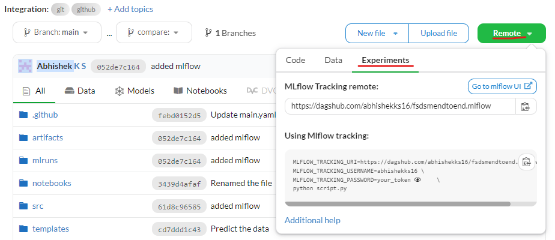

# This is my first end to end project

## First initialize the git
```
git init     
git add abc.txt ## adds the abc.txt file     
git add . ## adds all the file in the directory    
git commit -m "this is my first commit"  
git pull     
bash init_setup.sh # Note : use bash/Git bash/linux terminal
python template.py # To create the project template using python script.
```

## Ways to install the local packages
```
pip list # Lists all the packages installed
1 : python setup.py install # To install the local packages
pip uninstall DiamondPricePrediction # Uninstalls the package
2 : -e . # Add this line inside the requirements.txt and run "pip install -r requirements.txt"
```

## Data training 
> python src/DiamondPricePrediction/pipelines/training_pipeline.py

## Running Flask app
> python app.py


## MLflow

[Documentation](https://mlflow.org/docs/latest/index.html)


##### local cmd
- mlflow ui

### dagshub
[dagshub](https://dagshub.com/)




MLFLOW_TRACKING_URI=https://dagshub.com/abhishekks16/fsdsmendtoend.mlflow \
MLFLOW_TRACKING_USERNAME=abhishekks16 \
MLFLOW_TRACKING_PASSWORD=<password> \
python script.py

Run this to export as env variables:

```bash

export MLFLOW_TRACKING_URI=https://dagshub.com/abhishekks16/fsdsmendtoend.mlflow
export MLFLOW_TRACKING_USERNAME=abhishekks16
export MLFLOW_TRACKING_PASSWORD=<password>

```


### DVC cmd
- dvc init
- dvc repro
- dvc dag